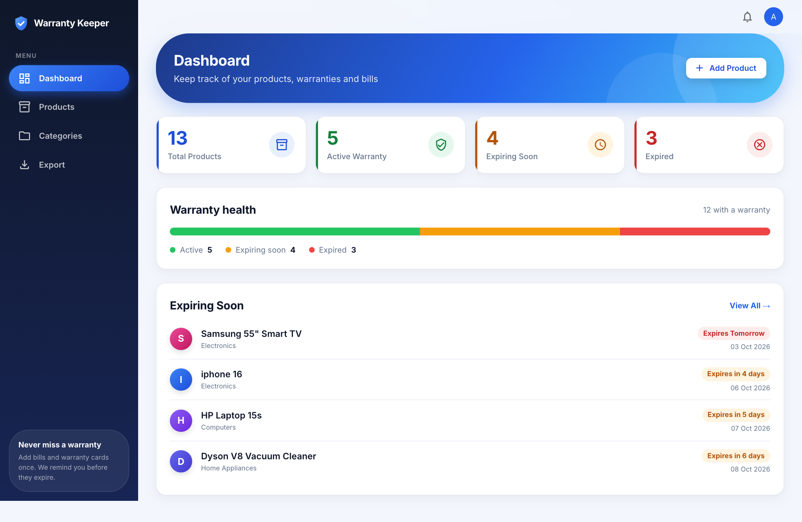
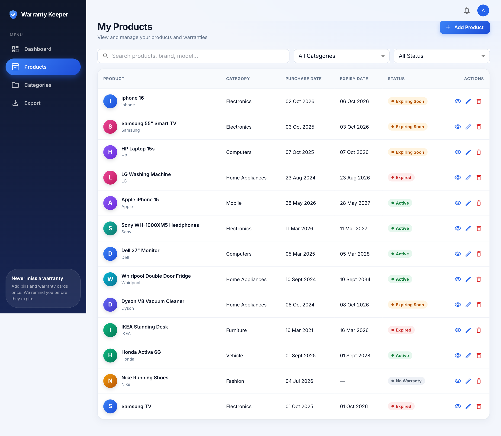

# Warranty Keeper

Track product warranties, store purchase documents, and get notified before a warranty expires.

## Features

- **Dashboard** – counts of active, expiring-soon (default: 7 days) and expired warranties, plus a list of products about to expire
- **Products** – add, edit, delete, search and filter products with purchase date and warranty period (days/months/years)
- **Documents** – attach invoices, warranty cards and other files (up to 10 MB each) to a product; preview or download them
- **Barcode scanner** – scan a product barcode in the browser (ZXing) to pre-fill product details via local and optional external lookup
- **Categories** – manage categories, with reassignment of products when deleting one
- **Notifications** – a daily job (08:00) creates notifications for expiring warranties; mark them as read from the header popup
- **Export** – download all or filtered products as CSV
- **Authentication** – single admin account with cookie-based session (12 h)
- **Responsive UI** – works on desktop and mobile

## Tech stack

| Layer     | Technology |
|-----------|------------|
| Frontend  | React 19, TypeScript, Vite, MUI 7, TanStack Query, React Hook Form + Zod, Axios, React Router |
| Backend   | Java 21, Quarkus 3.40 (REST/Jackson, Hibernate ORM Panache, Flyway, Scheduler, SmallRye OpenAPI) |
| Database  | MySQL 8.4 (H2 in-memory for backend tests) |
| Packaging | Docker / Docker Compose, nginx serving the frontend |

## Project structure

```
backend/      Quarkus REST API (controller, service, repository, entity, dto, security, scheduler)
frontend/     React app (pages, features, components, services, routes)
scripts/      seed_mock_data.py – loads sample products through the API
docs/screenshots/   UI screenshots
docker-compose.yml  MySQL + backend + frontend
```

## Quick start (Docker)

1. Create a `.env` file in the project root:

   ```env
   MYSQL_PASSWORD=choose_a_password
   MYSQL_ROOT_PASSWORD=choose_a_root_password
   ADMIN_PASSWORD=choose_an_admin_password
   AUTH_SECRET=a_long_random_string
   ```

2. Start everything:

   ```bash
   docker compose up --build
   ```

3. Open:
   - App: http://localhost:3000 (sign in as `admin` with your `ADMIN_PASSWORD`)
   - API: http://localhost:8080/api
   - Swagger UI: http://localhost:8080/q/swagger-ui

Optional sample data (the script defaults to port 8081, so pass the API URL):

```bash
ADMIN_PASSWORD=... python3 scripts/seed_mock_data.py http://localhost:8080/api
```

### Configuration

| Variable | Default | Description |
|----------|---------|-------------|
| `MYSQL_PASSWORD`, `MYSQL_ROOT_PASSWORD` | – (required) | Database credentials |
| `MYSQL_DATABASE` / `MYSQL_USER` | `warranty_keeper` / `warranty_user` | Database name and user |
| `ADMIN_PASSWORD` | – (required) | Admin login password |
| `ADMIN_USERNAME` | `admin` | Admin login name |
| `AUTH_SECRET` | – (required) | Secret used to sign sessions |
| `AUTH_COOKIE_SECURE` | `false` | Set `true` when served over HTTPS |
| `CORS_ORIGINS` | `http://localhost:3000` | Allowed frontend origins |
| `API_PORT` / `FRONTEND_PORT` | `8080` / `3000` | Published ports |
| `VITE_API_BASE_URL` | `http://localhost:8080/api` | API URL baked into the frontend build |
| `UPLOAD_DIR` | `/app/uploads` | Document storage (Docker volume) |
| `LOOKUP_EXTERNAL_ENABLED` | `true` | Enable external barcode lookup |
| `TZ` | `UTC` | Time zone |

## Local development

**Backend** (requires Java 21, Maven and a MySQL instance):

```bash
cd backend
export QUARKUS_DATASOURCE_JDBC_URL=jdbc:mysql://localhost:3306/warranty_keeper
export QUARKUS_DATASOURCE_USERNAME=warranty_user
export QUARKUS_DATASOURCE_PASSWORD=...
export ADMIN_PASSWORD=... AUTH_SECRET=...
mvn quarkus:dev
```

Flyway migrations run automatically on startup.

**Frontend** (requires Node.js):

```bash
cd frontend
npm install
npm run dev        # http://localhost:5173
```

The dev frontend calls the API at `VITE_API_BASE_URL`; point it at your backend if it is not `http://localhost:8080/api`.

## Testing

```bash
cd backend && mvn test      # uses in-memory H2, auth disabled
cd frontend && npm test     # vitest
```

## API overview

All endpoints are under `/api` and require login (except `/auth/login`).

| Area | Endpoints |
|------|-----------|
| Auth | `POST /auth/login`, `POST /auth/logout`, `GET /auth/me` |
| Products | `GET /products`, `GET /products/{id}`, `POST /products`, `PUT /products/{id}`, `DELETE /products/{id}`, `GET /products/lookup`, `GET /products/export` |
| Documents | `GET`/`POST /products/{productId}/documents`, `GET /documents/{id}/download`, `DELETE /documents/{id}` |
| Categories | `GET`/`POST /categories`, `PUT /categories/{id}`, `DELETE /categories/{id}?reassignTo=` |
| Dashboard | `GET /dashboard/summary`, `GET /dashboard/expiring` |
| Notifications | `GET /notifications`, `PUT /notifications/{id}/read` |

Full interactive docs are available in Swagger UI.

## Screenshots

Screenshots of the login, dashboard, products, scanner, categories, notifications, export and mobile views are in [docs/screenshots/](docs/screenshots).

| Dashboard | Products |
|-----------|----------|
|  |  |
